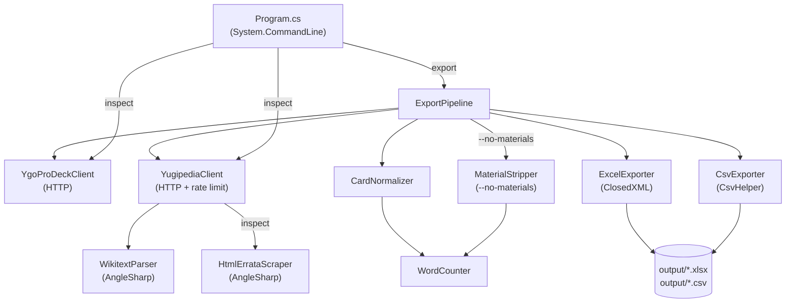

# CardPool

> **Disclaimer:** CardPool is an independent fan project and is not affiliated with, endorsed by, or sponsored by Konami Digital Entertainment. Yu-Gi-Oh! is a trademark of Konami. Card text and artwork are the intellectual property of their respective owners.
>
> Card data is fetched from [YGOProDeck](https://ygoprodeck.com/), which is available for personal, non-commercial use. Users of this tool are responsible for complying with [YGOProDeck's terms of service](https://ygoprodeck.com/terms-of-service/).

Card pool analysis tool for trading card games. Fetches card data from game-specific sources, enriches it with errata history, applies word-count rules, and exports to Excel/CSV.

**Current implementation: Yu-Gi-Oh! (Edison format).** The goal is to support multiple TCGs — Yu-Gi-Oh! is the first. Cards are fetched from [YGOProDeck](https://ygoprodeck.com/) and enriched with errata history from [Yugipedia](https://yugipedia.com/).

The core purpose: identify cards whose **shortest known errata version** falls within a word-count threshold (default: ≤25 words), making them eligible under Edison format's word-count rule regardless of current oracle text.

---

## Installation

### Option A — .NET Global Tool (recommended for developers)

Requires [.NET 10 SDK](https://dotnet.microsoft.com/download/dotnet/10.0).

```bash
dotnet tool install -g CardPool
cpool --help
```

To update: `dotnet tool update -g CardPool`  
To remove: `dotnet tool uninstall -g CardPool`

### Option B — Self-contained executable (no .NET required)

Download the latest zip for your platform from the [Releases](https://github.com/piers-sinclair/cardpool/releases) page:

| Platform | File |
|----------|------|
| Windows x64 | `cpool-win-x64.zip` |
| Windows ARM64 | `cpool-win-arm64.zip` |
| Linux x64 | `cpool-linux-x64.zip` |

**Windows:** Extract the zip, then right-click `install.ps1` → **Run with PowerShell**. Open a new terminal — `cpool` is now on your PATH.

> If PowerShell blocks the script: `Set-ExecutionPolicy -Scope CurrentUser RemoteSigned`

**Linux:** Extract the zip, then `chmod +x cpool && sudo mv cpool /usr/local/bin/`

To uninstall (Windows): right-click `uninstall.ps1` → **Run with PowerShell**.

### Option C — Run from source

```bash
git clone https://github.com/piers-sinclair/cardpool
dotnet run --project src/CardPool.Cli -- export
```

### Sharing with someone without repo access

Build a self-contained zip and send it:

```powershell
dotnet publish src/CardPool.Cli -p:PublishProfile=win-x64 -o dist/win-x64
Compress-Archive -Path dist/win-x64/cpool.exe, install.ps1, uninstall.ps1, INSTALL_README.md -DestinationPath cpool-win-x64.zip
```

The recipient only needs to unzip and run `install.ps1` — no .NET installation required.

---

## Commands

### `cpool export`

Export all card data to Excel (`.xlsx`) and CSV. Output files are written to `./output/` by default.

```bash
cpool export                              # default: <=25 words, no-materials, no-link, no-pendulum
cpool export --words 20                   # <=20 words
cpool export --no-materials false         # include full material text in word count
cpool export --extra-deck all             # include all Extra Deck types (including Link)
cpool export --extra-deck none            # main-deck cards only
cpool export --extra-deck fusion synchro  # Fusion + Synchro only
cpool export --no-pendulum false          # include Pendulum monsters
cpool export --words 30 --output ~/ygo    # <=30 words, custom output dir
```

| Option | Default | Description |
|--------|---------|-------------|
| `--words` | `25` | Word-count threshold — cards with any printing at or below this limit are included |
| `--no-materials` | `true` | Strip fusion/synchro/xyz/link material requirements from effect text before counting; original materials are preserved in a separate column |
| `--extra-deck` | `fusion synchro xyz` | Extra Deck types to include — valid values: `all`, `none`, `fusion`, `synchro`, `xyz`, `link` (repeatable) |
| `--no-pendulum` | `true` | Exclude Pendulum monsters from output |
| `--output` | `./output` | Directory to write output files to |

### `cpool inspect`

Show all errata versions for a single card with word counts, highlighting the shortest and latest versions.

```bash
cpool inspect "Raiza the Storm Monarch"
cpool inspect "Dark Magician"
```

### Global options

```bash
cpool --help      # show available commands
cpool --version   # show installed version
```

---

## Development

### Requirements

- [.NET 10 SDK](https://dotnet.microsoft.com/download/dotnet/10.0)

### Run from source

```bash
dotnet run --project src/CardPool.Cli -- export
dotnet run --project src/CardPool.Cli -- export --words 25
dotnet run --project src/CardPool.Cli -- inspect "Raiza the Storm Monarch"
```

### Tests

```bash
dotnet test tests/CardPool.Tests --filter "Category!=Integration"   # unit tests (fast)
dotnet test tests/CardPool.Tests --filter "Category=Integration"    # live API tests (~5 min)
dotnet test tests/CardPool.Tests                                    # all tests
```

---

## Architecture



---

## Output Columns

| Column | Description |
|--------|-------------|
| `id`, `name`, `type`, `race`, `attribute` | Core card identity |
| `level`, `atk`, `def`, `scale`, `linkval`, `linkmarkers` | Stats |
| `archetype` | Card archetype |
| `desc` | Current oracle text (from YGOProDeck) |
| `shortest_errata` | The errata version with the fewest words; falls back to `desc` if no Yugipedia page exists |
| `latest_errata` | The most recent errata version; falls back to `desc` |
| `word_count` | Effective word count of `shortest_errata`, applying game counting rules |
| `is_eligible` | `true` if `word_count` ≤ threshold |
| `set_name`, `set_code`, `set_rarity` | First card set from YGOProDeck |
| `ban_tcg`, `ban_ocg` | Current banlist status |
| `image_url` | Card artwork URL |

The Excel workbook has two sheets: `<=N Words` and `>N Words` (where N is the threshold).

---

## Word Counting Rules

| Card Type | What's Counted |
|-----------|----------------|
| Normal Monster (no Pendulum) | 0 — all text is flavour |
| Pendulum Normal Monster | Pendulum Effect box only |
| Pendulum Effect Monster | Pendulum Effect box + Monster Effect box |
| All others (Effect Monsters, Spells, Traps) | Full description text |

The shortest errata is selected by fewest raw words across all errata versions; ties go to the latest version. The word count is then the card-type-adjusted count of that text.

---

## Edison Format Context

**Edison format** uses the September 2010 banlist.

**The ≤20-word rule:** If any printing of a card (pre-errata, typo print, etc.) has ≤20 words in its effect text, the card may be played as that printing is written — regardless of what the current oracle text says.

**Key Edison rulings:**
- **Damage Step priority**: Fast effects (spell speed 2+) may be activated during the Damage Step without needing to chain.
- **Turn player priority**: The turn player may activate ignition effects at the start of a new phase or after a chain resolves before the opponent can respond.

---

## Tech Stack

| Component | Technology |
|-----------|------------|
| Runtime | .NET 10 |
| CLI parsing | System.CommandLine |
| HTML parsing | AngleSharp |
| Excel output | ClosedXML |
| CSV output | CsvHelper |
| HTTP | HttpClient + System.Text.Json |
| Tests | xUnit + Shouldly + NSubstitute |

---

## License

MIT — see [LICENSE](LICENSE).
