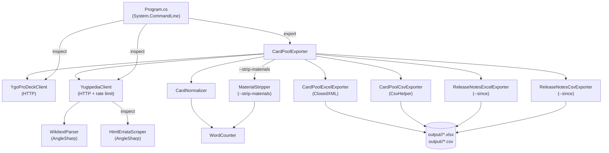

# CardPool

> **Disclaimer:** CardPool is an independent fan project and is not affiliated with, endorsed by, or sponsored by Konami Digital Entertainment. Yu-Gi-Oh! is a trademark of Konami. Card text and artwork are the intellectual property of their respective owners.
>
> Card data is fetched from [YGOProDeck](https://ygoprodeck.com/) and errata history from [Yugipedia](https://yugipedia.com/). Users of this tool are responsible for complying with the terms of use of both services. Output files generated by this tool may contain copyrighted card data and should not be publicly redistributed.

Card pool analysis tool for trading card games. Fetches card data from game-specific sources, enriches it with errata history, applies word-count rules, and exports to Excel/CSV.

Originally built to support 25 Format. Check out the [Discord server](https://discord.gg/wDXgNHukb) for more info!

**Current implementation: Yu-Gi-Oh!** The goal is to support multiple TCGs — Yu-Gi-Oh! is the first. Cards are fetched from [YGOProDeck](https://ygoprodeck.com/) and enriched with errata history from [Yugipedia](https://yugipedia.com/).

The core purpose: identify cards whose **shortest known errata version** falls within a word-count threshold (default: ≤25 words).

---

## Installation

### Option A — .NET Global Tool (recommended for developers)

Requires [.NET 10 SDK](https://dotnet.microsoft.com/download/dotnet/10.0).

```bash
dotnet tool install -g CardPool
cpool --help
```

To update: `dotnet tool update -g CardPool`  
To remove: `dotnet tool uninstall -g CardPool`

### Option B — winget (Windows)

```powershell
winget install PiersSinclair.CardPool
```

To update: `winget upgrade PiersSinclair.CardPool`  
To remove: `winget uninstall PiersSinclair.CardPool`

### Option C — Homebrew (macOS + Linux)

```bash
brew tap piers-sinclair/cpool
brew install cpool
```

To update: `brew upgrade cpool`  
To remove: `brew uninstall cpool && brew untap piers-sinclair/cpool`

### Option D — Self-contained executable (direct download)

Download the latest zip for your platform from the [Releases](https://github.com/piers-sinclair/cardpool/releases) page:

| Platform | File |
|----------|------|
| Windows x64 | `cpool-win-x64.zip` |
| Windows ARM64 | `cpool-win-arm64.zip` |
| macOS ARM64 (Apple Silicon) | `cpool-osx-arm64.zip` |
| macOS x64 (Intel) | `cpool-osx-x64.zip` |
| Linux x64 | `cpool-linux-x64.zip` |

**Windows:** Extract the zip, then run `install.ps1` (right-click → Run with PowerShell). Open a new terminal — `cpool` is now on your PATH.

> If PowerShell blocks the script: `Set-ExecutionPolicy -Scope CurrentUser RemoteSigned`

**macOS / Linux:** Extract the zip, then run `bash install.sh`. Open a new terminal — `cpool` is now on your PATH.

To uninstall — Windows: run `uninstall.ps1`; macOS/Linux: run `bash uninstall.sh`.

### Option E — Run from source

```bash
git clone https://github.com/piers-sinclair/cardpool
dotnet run --project src/CardPool.Cli -- export
```

### Sharing with someone without repo access

Build a platform zip and send it (recipient needs no .NET):

```bash
# Windows
dotnet publish src/CardPool.Cli -p:PublishProfile=win-x64 -o dist/win-x64

# macOS (Apple Silicon)
dotnet publish src/CardPool.Cli -p:PublishProfile=osx-arm64 -o dist/osx-arm64

# Linux
dotnet publish src/CardPool.Cli -p:PublishProfile=linux-x64 -o dist/linux-x64
```

---

## Commands

### `cpool export`

Export all card data to Excel (`.xlsx`) and CSV. Output files are written to `./output/<date>/` by default.

> Only TCG-legal cards are included — cards with no known TCG release date (OCG-only, digital-only, etc.) are excluded automatically.

```bash
cpool export                                         # default: <=25 words, strip-materials, exclude pendulum link
cpool export --words 20                              # <=20 words
cpool export --strip-materials false                 # include full material text in word count
cpool export --exclude-types none                    # include all card types
cpool export --exclude-types fusion synchro xyz link # main-deck cards only
cpool export --exclude-types pendulum link flip      # also exclude Flip monsters
cpool export --errata-mode latest                    # use current text only (fast — no Yugipedia fetch)
cpool export --words -1                              # no word limit — export all cards
cpool export --since 2025-01-01                      # also generate release notes for cards eligible since this date
cpool export --words 30 --output ~/ygo               # <=30 words, custom output dir
```

| Option | Default | Description |
|--------|---------|-------------|
| `--words` | `25` | Word-count threshold — cards with any printing at or below this limit are included. Use `-1` for no limit |
| `--strip-materials` | `true` | Strip fusion/synchro/xyz/link material requirements from effect text before counting; original materials are preserved in a separate column |
| `--exclude-types` | `pendulum link` | Exclude cards whose type contains any of these fragments (case-insensitive, repeatable). Use `none` to include all types |
| `--errata-mode` | `shortest` | Which text version to evaluate: `shortest` = any historical printing (fetches Yugipedia), `latest` = current printing only (fast, no Yugipedia fetch) |
| `--since` | _(none)_ | Generate a release notes file alongside the export showing cards that became eligible on or after this date (`YYYY-MM-DD`) |
| `--output` | `./output` | Directory to write output files to |

### `cpool inspect`

Show all errata versions for a single card with word counts, highlighting the shortest and latest versions.

```bash
cpool inspect "Raiza the Storm Monarch"
cpool inspect "Dark Magician"
```

### Global options

```bash
cpool --help      # show available commands
cpool --version   # show installed version
```

---

## Development

### Requirements

- [.NET 10 SDK](https://dotnet.microsoft.com/download/dotnet/10.0)

### Releasing

See [RELEASING.md](RELEASING.md) for the full release process, including how to renew the NuGet, winget, and Homebrew secrets.

### Run from source

```bash
dotnet run --project src/CardPool.Cli -- export
dotnet run --project src/CardPool.Cli -- export --words 25
dotnet run --project src/CardPool.Cli -- export --errata-mode latest
dotnet run --project src/CardPool.Cli -- export --since 2025-01-01
dotnet run --project src/CardPool.Cli -- inspect "Raiza the Storm Monarch"
```

### Tests

```bash
dotnet test tests/CardPool.Tests
```

---

## Architecture



---

## Output Columns

| Column | Description |
|--------|-------------|
| `name` | Card name |
| `card_type` | Full card type string (e.g. "Effect Monster", "Spell Card") |
| `attribute` | Attribute (DARK, LIGHT, etc.) — monsters only |
| `subtype` | Monster subtype / race (e.g. "Warrior", "Spellcaster") |
| `level` | Level or Rank — monsters only |
| `atk`, `def` | Attack / Defence |
| `scale` | Pendulum Scale — Pendulum monsters only |
| `linkval` | Link Rating — Link monsters only |
| `linkmarkers` | Comma-separated Link Markers — Link monsters only |
| `archetype` | Card archetype |
| `materials` | Stripped material requirement text (only present when `--strip-materials true`) |
| `shortest_errata` | The errata version with the fewest words; falls back to current oracle text if no Yugipedia page exists |
| `latest_errata` | The most recent errata version; falls back to current oracle text |
| `eligible_since` | Earliest date (`YYYY-MM-DD`) any errata version of this card met the word threshold |
| `word_count` | Effective word count of `shortest_errata`, applying game counting rules |
| `is_eligible` | `true` if `word_count` ≤ threshold |
| `id` | YGOProDeck numeric card ID |
| `image_url` | Card artwork URL |

The main export workbook has two sheets: `<=N Words` (eligible cards) and `>N Words` (ineligible cards).
When `--since` is provided, a separate release notes workbook is also produced containing only cards whose `eligible_since` date falls on or after the given date.

---

## Word Counting Rules

| Card Type | What's Counted |
|-----------|----------------|
| Normal Monster (no Pendulum) | 0 — all text is flavour |
| Pendulum Normal Monster | Pendulum Effect box only |
| Pendulum Effect Monster | Pendulum Effect box + Monster Effect box |
| All others (Effect Monsters, Spells, Traps) | Full description text |

The shortest errata is selected by fewest raw words across all errata versions; ties go to the latest version. The word count is then the card-type-adjusted count of that text.

---

## Tech Stack

| Component | Technology |
|-----------|------------|
| Runtime | .NET 10 |
| CLI parsing | System.CommandLine |
| HTML parsing | AngleSharp |
| Excel output | ClosedXML |
| CSV output | CsvHelper |
| HTTP | HttpClient + System.Text.Json |
| Tests | xUnit + Shouldly + NSubstitute |

---

## License

MIT — see [LICENSE](LICENSE).
