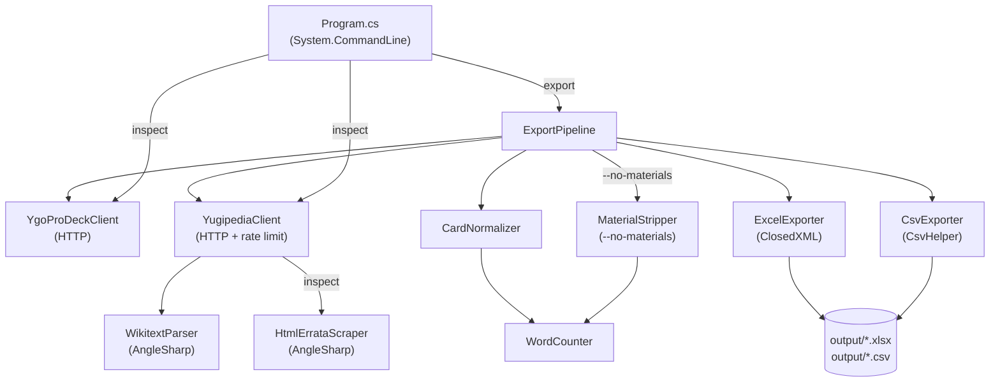

# CardPool

> **Disclaimer:** CardPool is an independent fan project and is not affiliated with, endorsed by, or sponsored by Konami Digital Entertainment. Yu-Gi-Oh! is a trademark of Konami. Card text and artwork are the intellectual property of their respective owners.
>
> Card data is fetched from [YGOProDeck](https://ygoprodeck.com/), which is available for personal, non-commercial use. Users of this tool are responsible for complying with [YGOProDeck's terms of service](https://ygoprodeck.com/terms-of-service/).

Card pool analysis tool for trading card games. Fetches card data from game-specific sources, enriches it with errata history, applies word-count rules, and exports to Excel/CSV.

**Current implementation: Yu-Gi-Oh! (Edison format).** The goal is to support multiple TCGs — Yu-Gi-Oh! is the first. Cards are fetched from [YGOProDeck](https://ygoprodeck.com/) and enriched with errata history from [Yugipedia](https://yugipedia.com/).

The core purpose: identify cards whose **shortest known errata version** falls within a word-count threshold (default: ≤20 words), making them eligible under Edison format's word-count rule regardless of current oracle text.

---

## Requirements

- [.NET 10 SDK](https://dotnet.microsoft.com/download/dotnet/10.0)

---

## Usage

```bash
# Full export at ≤20 words (default)
dotnet run --project src/CardPool.Cli -- export

# Change the word-count threshold
dotnet run --project src/CardPool.Cli -- export --words 25
dotnet run --project src/CardPool.Cli -- export --words 30

# Strip material requirements from Extra Deck monsters
dotnet run --project src/CardPool.Cli -- export --no-materials
dotnet run --project src/CardPool.Cli -- export --no-materials --words 25

# Inspect a single card's errata history
dotnet run --project src/CardPool.Cli -- inspect "Raiza the Storm Monarch"

# Run unit tests
dotnet test tests/CardPool.Tests --filter "Category!=Integration"

# Run live API regression tests (~5 min)
dotnet test tests/CardPool.Tests --filter "Category=Integration"
```

All outputs go to the `output/` directory (created automatically).

---

## Architecture



---

## Output Columns

| Column | Description |
|--------|-------------|
| `id`, `name`, `type`, `race`, `attribute` | Core card identity |
| `level`, `atk`, `def`, `scale`, `linkval`, `linkmarkers` | Stats |
| `archetype` | Card archetype |
| `desc` | Current oracle text (from YGOProDeck) |
| `shortest_errata` | The errata version with the fewest words; falls back to `desc` if no Yugipedia page exists |
| `latest_errata` | The most recent errata version; falls back to `desc` |
| `word_count` | Effective word count of `shortest_errata`, applying game counting rules |
| `is_eligible` | `true` if `word_count` ≤ threshold |
| `set_name`, `set_code`, `set_rarity` | First card set from YGOProDeck |
| `ban_tcg`, `ban_ocg` | Current banlist status |
| `image_url` | Card artwork URL |

The Excel workbook has two sheets: `<=N Words` and `>N Words` (where N is the threshold).

---

## Word Counting Rules

| Card Type | What's Counted |
|-----------|----------------|
| Normal Monster (no Pendulum) | 0 — all text is flavour |
| Pendulum Normal Monster | Pendulum Effect box only |
| Pendulum Effect Monster | Pendulum Effect box + Monster Effect box |
| All others (Effect Monsters, Spells, Traps) | Full description text |

The shortest errata is selected by fewest raw words across all errata versions; ties go to the latest version. The word count is then the card-type-adjusted count of that text.

---

## Edison Format Context

**Edison format** uses the September 2010 banlist.

**The ≤20-word rule:** If any printing of a card (pre-errata, typo print, etc.) has ≤20 words in its effect text, the card may be played as that printing is written — regardless of what the current oracle text says.

**Key Edison rulings:**
- **Damage Step priority**: Fast effects (spell speed 2+) may be activated during the Damage Step without needing to chain.
- **Turn player priority**: The turn player may activate ignition effects at the start of a new phase or after a chain resolves before the opponent can respond.

---

## Tech Stack

| Component | Technology |
|-----------|------------|
| Runtime | .NET 10 |
| CLI parsing | System.CommandLine |
| HTML parsing | AngleSharp |
| Excel output | ClosedXML |
| CSV output | CsvHelper |
| HTTP | HttpClient + System.Text.Json |
| Tests | xUnit + Shouldly + NSubstitute |

---

## License

MIT — see [LICENSE](LICENSE).
